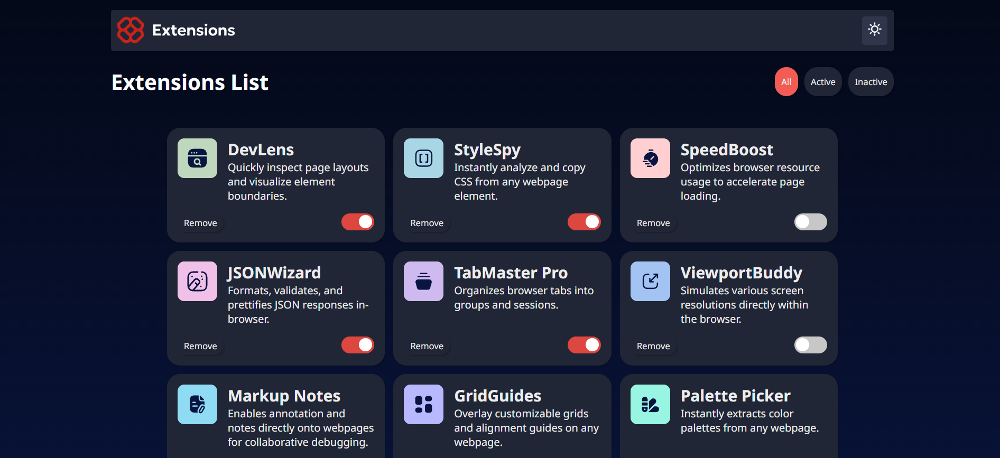

# Frontend Mentor - Browser extensions manager UI solution

This is a solution to the [Browser extensions manager UI challenge on Frontend Mentor](https://www.frontendmentor.io/challenges/browser-extension-manager-ui-yNZnOfsMAp). Frontend Mentor challenges help you improve your coding skills by building realistic projects. 

## Table of contents

- [Overview](#overview)
  - [The challenge](#the-challenge)
  - [Screenshot](#screenshot)
  - [Links](#links)
- [My process](#my-process)
  - [Built with](#built-with)
  - [What I learned](#what-i-learned)
  - [Continued development](#continued-development)


## Overview

### The challenge

Users should be able to:

- Toggle extensions between active and inactive states
- Filter active and inactive extensions
- Remove extensions from the list
- Select their color theme
- View the optimal layout for the interface depending on their device's screen size
- See hover and focus states for all interactive elements on the page

### Screenshot





### Links

- Solution URL: [https://www.frontendmentor.io/solutions/browser-extensions-manger-ui-using-react-and-sass-dKBNNxEphR](https://www.frontendmentor.io/solutions/browser-extensions-manger-ui-using-react-and-sass-dKBNNxEphR)
- Live Site URL: [https://browser-extensions-manager-ui-main-gules.vercel.app/](https://browser-extensions-manager-ui-main-gules.vercel.app/)

## My process

### Built with

- Semantic HTML5 markup
- CSS custom properties
- Flexbox
- Mobile-first workflow
- [React](https://reactjs.org/) - JS library
- SASS


### What I learned

```js

function toggleCardActive(id) {
    setCards((prev) => 
    prev.map((card) => 
    card.id === id ? { ...card, isActive: !card.isActive } : card));
  }

  // Remove card by ID
  function removeCard(id) {
    setCards((prev) => prev.filter((card) => card.id != id));
  }

  // Handle theme change
  function handleThemeChange() {
    setTheme(prev => (prev === 'light' ? 'dark' : 'light'))
  }

```
One of the things I had the most trouble with was the card active states and theme changes. I needed a bit of help, but I feel like I got a better understanding of 'prev'.

```jsx

<button
  onClick={() => onClick(id)}
  className={`btn shadow ${active ? "btn-active" : ""} ${className}`}>
    {label}
</button>

```

While this isn't something new to me, I also had fun with conditional rendering, and using conditionals in general. I learned how to conditionally add classes based on a button's active state.


### Continued development

Going forward, I want to write cleaner code. I plan on taking a shot at creating a full stack app, as I think it would be good to have that sort of experience under my belt. I also plan on using Tailwind CSS in future projects.

